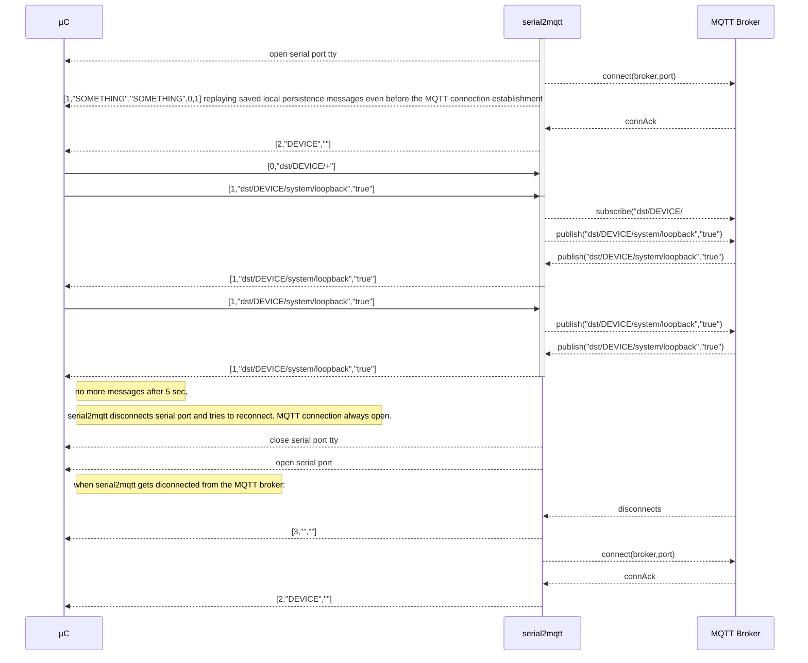
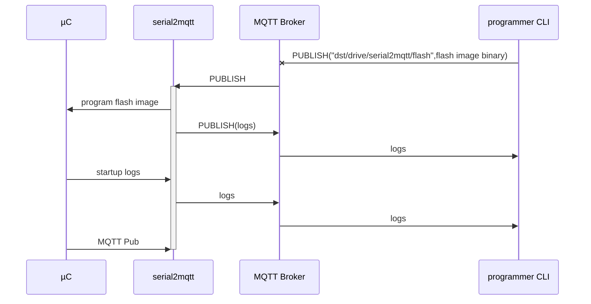

## CONNECTION SETUP

```mermaid
sequenceDiagram
participant µC
participant serial2mqtt
participant MQTT Broker

activate serial2mqtt
serial2mqtt-->>µC: open serial port tty
serial2mqtt-->>MQTT Broker: connect(broker,port)
serial2mqtt-->>µC: [1,"SOMETHING","SOMETHING",0,1]   replaying saved local persistence messages even before the MQTT connection establishment
MQTT Broker -->> serial2mqtt: connAck
serial2mqtt-->>µC: [2,"DEVICE",""]
µC->> serial2mqtt: [0,"dst/DEVICE/+"]
µC->> serial2mqtt : [1,"dst/DEVICE/system/loopback","true"]
deactivate serial2mqtt

activate serial2mqtt
serial2mqtt-->>MQTT Broker: subscribe("dst/DEVICE/#")
serial2mqtt-->>MQTT Broker: publish("dst/DEVICE/system/loopback","true")
MQTT Broker-->>serial2mqtt: publish("dst/DEVICE/system/loopback","true")
serial2mqtt-->>µC : [1,"dst/DEVICE/system/loopback","true"]
deactivate serial2mqtt

activate serial2mqtt
µC->> serial2mqtt : [1,"dst/DEVICE/system/loopback","true"]
serial2mqtt-->>MQTT Broker: publish("dst/DEVICE/system/loopback","true")
MQTT Broker-->>serial2mqtt: publish("dst/DEVICE/system/loopback","true")
serial2mqtt-->>µC : [1,"dst/DEVICE/system/loopback","true"]
deactivate serial2mqtt

Note right of µC: no more messages after 5 sec, 
Note right of µC: serial2mqtt disconnects serial port and tries to reconnect. MQTT connection always open.
serial2mqtt-->>µC: close serial port tty
serial2mqtt-->>µC: open serial port

Note right of µC: when serial2mqtt gets diconnected from the MQTT broker:
MQTT Broker-->>serial2mqtt: disconnects
serial2mqtt-->>µC: [3,"",""]
serial2mqtt-->>MQTT Broker: connect(broker,port)
MQTT Broker -->> serial2mqtt: connAck
serial2mqtt-->>µC: [2,"DEVICE",""]
```
# Programming through serial2mqtt
A command line utility will send a single mqtt request to the serial2mqtt gateway to program the microcontroller.

```mermaid
sequenceDiagram
participant µC
participant serial2mqtt
participant MQTT Broker
participant programmer CLI
programmer CLI -x MQTT Broker: PUBLISH("dst/drive/serial2mqtt/flash",flash image binary)
MQTT Broker ->> serial2mqtt : PUBLISH
activate serial2mqtt
serial2mqtt ->> µC : program flash image
serial2mqtt ->> MQTT Broker : PUBLISH(logs)
MQTT Broker ->> programmer CLI : logs
µC ->> serial2mqtt : startup logs
serial2mqtt ->> MQTT Broker : logs
MQTT Broker ->> programmer CLI : logs
µC ->> serial2mqtt : MQTT Pub
deactivate serial2mqtt
```
