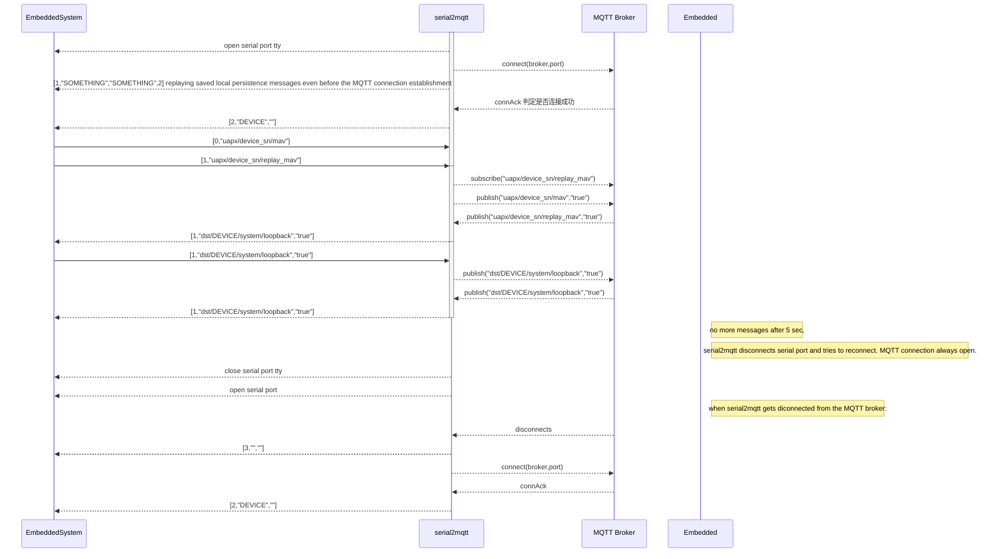
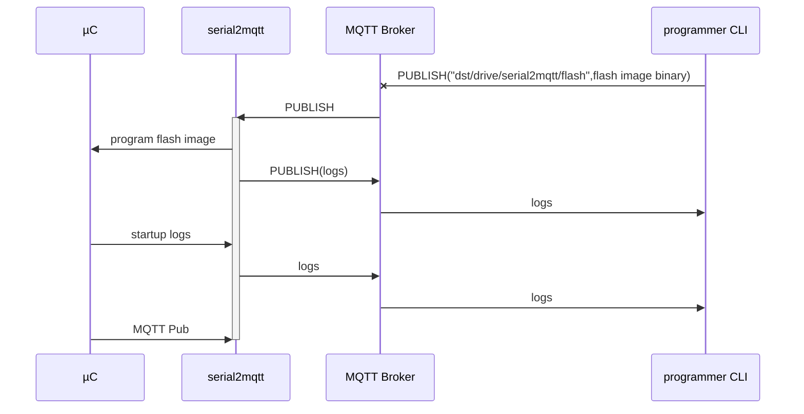

# 协议 Protocol
Example : [1,"mytopic","3.141592653"]
```
[<COMMAND>,<TOPIC>,<MESSAGE>,<QOS>,<RETAIN>,<CRC>] 
* QOS ,RETAIN, CRC 三项保留可选
<CRC> : can be checked or not, is calculated on the total JSON string based on the message containing "0000" as temporary CRC. When calculated is in HEX format.
* COMMAND 0:SUBSCRIBE,1:PUBLISH,2:MQTT-CONN,3:MQTT-DISC
* publish : [1,"dst/topic1","message1",0,0]
* subscribe : [0,"dst/myTopic/#"]
* QOS : 0,1,2 : for QOS, default 0
* RETAIN : 0 or 1 for true or false, default 0
```
- 发布示例 publish : [1,"myTopicPi","3.141592653"]
- 订阅示例 subscribe : [0,"myTopics/#"]

## 工作流程


# Programming through serial2mqtt
A command line utility will send a single mqtt request to the serial2mqtt gateway to program the microcontroller.

